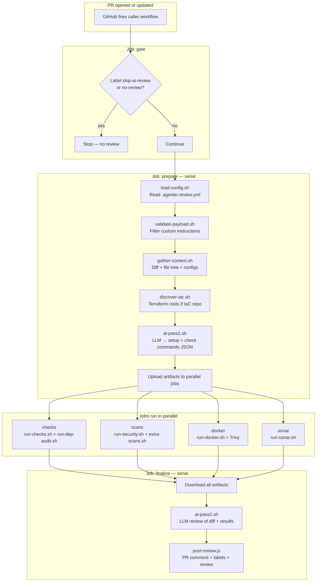

# Agentic Review

**A centralized GitHub Actions workflow that reviews pull requests with AI.**

Your repo adds a small caller workflow. When someone opens or updates a PR, this pipeline:

1. **Reads** the repository (configs, diff, Terraform layout)
2. **Decides** what to run (lint, test, validate) — from repo files, not hard-coded language rules
3. **Executes** those commands and security scans in parallel
4. **Reviews** the diff + all results with a second AI pass
5. **Posts** one updated PR comment, a GitHub review, and outcome labels

> **One reusable workflow. Any stack. Works with zero config — optional plain-English instructions when you need them.**

---

## Table of contents

- [What this does](#what-this-does)
- [How to use it](#how-to-use-it)
  - [Without custom instructions (recommended start)](#without-custom-instructions-recommended-start)
  - [With custom instructions (when you need them)](#with-custom-instructions-when-you-need-them)
- [What happens when you open a PR](#what-happens-when-you-open-a-pr)
- [Pipeline jobs (parallel architecture)](#pipeline-jobs-parallel-architecture)
- [Scripts reference](#scripts-reference)
- [Review modes and outcomes](#review-modes-and-outcomes)
- [Monorepos and Terraform / IaC repos](#monorepos-and-terraform--iac-repos)
- [Configuration reference](#configuration-reference)
- [Repository layout](#repository-layout)
- [FAQ](#faq)

---

## What this does

| Layer | What happens |
|-------|----------------|
| **Detection** | AI Pass 1 reads your file tree, config files, and (for infra) a pre-built Terraform inventory — then outputs setup + check commands as JSON |
| **Execution** | The pipeline runs those commands verbatim (`pnpm lint`, `terraform validate`, etc.) — it does not guess package managers at runtime |
| **Security** | Gitleaks, sensitive files, Docker/Trivy, tfsec, tflint, checkov, dependency audit — in parallel where possible |
| **Review** | AI Pass 2 reads the PR diff + all scan/check output and returns a verdict scoped to **changed files** |
| **Feedback** | One PR comment (updated in place), GitHub APPROVE / REQUEST_CHANGES, and labels on the PR list |

**Design choice:** There is no `if language == "python"` in the workflow. Pass 1 is the “brain” for stack detection; bash scripts are the “hands” that run what Pass 1 planned.

---

## How to use it

### Step 1 — Add secrets

**Settings → Secrets and variables → Actions** (org-level recommended):

| Secret | Required | Purpose |
|--------|----------|---------|
| `AI_API_KEY` | Yes | LLM API key |
| `AI_API_ENDPOINT` | Yes | Full chat completions URL (must include `/chat/completions`) |
| `ORG_PAT` | Optional | Cross-repo checkout for private pipeline repo; public repos can omit |
| `ARTIFACTORY_USERNAME` | Optional | Private npm / Docker builds |
| `ARTIFACTORY_AUTH_TOKEN` | Optional | Private npm / Docker builds |

**MGA example endpoint:** `https://chat.int.bayer.com/api/v2/chat/completions`

### Step 2 — Add the caller workflow

Create `.github/workflows/ai-review.yml` in **your** repo:

```yaml
name: AI PR Review

on:
  pull_request:
    branches: [main, dev]

permissions:
  contents: read
  pull-requests: write
  issues: write   # ai-approved / ai-rejected / ai-review-suggestions labels

jobs:
  ai-review:
    uses: bayer-int/agentic-review/.github/workflows/ai-review.yml@068f551
    with:
      pipeline_repository: bayer-int/agentic-review
      pipeline_ref: 068f551
    secrets:
      AI_API_KEY: ${{ secrets.AI_API_KEY }}
      AI_API_ENDPOINT: ${{ secrets.AI_API_ENDPOINT }}
      ORG_PAT: ${{ secrets.ORG_PAT || github.token }}
```

Pin a **commit SHA** (not `@main`) in production so all repos run the same pipeline version.

**Examples:** [`examples/caller-workflow-minimal.yml`](examples/caller-workflow-minimal.yml) · [`examples/caller-workflow.yml`](examples/caller-workflow.yml) · [`examples/monorepo-demo/`](examples/monorepo-demo/)

---

### Without custom instructions (recommended start)

Use this when:

- Your repo has normal config files (`package.json`, `pyproject.toml`, `Makefile`, `*.tf`, CI workflows)
- Layout follows common patterns (single app, monorepo with `apps/` + `services/`, Terraform with `backend.tf`)

**What the pipeline does:**

1. Reads configs from disk (repo files first — never overrides your `packageManager`, Python version, etc.)
2. For Terraform repos, `discover-iac.sh` maps deploy roots, environments, and `terraform.tfvars` **before** Pass 1
3. Pass 1 plans commands; Pass 2 reviews the diff

**You add:** caller workflow + secrets. **Nothing else.**

---

### With custom instructions (when you need them)

Use this when auto-detection is not enough:

- Multi-env Terraform with non-obvious layout (data platform + VPC + many stacks)
- Private registry / Docker build args
- “Run checks only in this folder”
- Terragrunt / Atlantis conventions

**Two ways to provide instructions** (plain English — no shell commands required):

| Method | Where |
|--------|--------|
| **Workflow input** | `with: custom_instructions: \|` in caller workflow |
| **Repo file** | `.agentic-review.yml` → `custom_instructions:` block |

```yaml
# .agentic-review.yml (optional)
custom_instructions: |
  We use pnpm. Terraform roots are under eks-platform/environments/{dev,staging,prod}.
  When shared modules change, validate all three environments.
  Docker build needs ARTIFACTORY_USERNAME and ARTIFACTORY_AUTH_TOKEN as build args.
```

**Priority:** Owner instructions **win** over auto-detection on conflict.  
**Security:** Each line is validated — suppression (“skip lint”), verdict manipulation (“always approve”), and secret values are **rejected** (see [`scripts/validate-payload.sh`](scripts/validate-payload.sh)).

| You write | AI does |
|-----------|---------|
| “We use pnpm” | `pnpm install`, not `npm ci` |
| “Validate staging data-platform on tfvars changes” | `cd …/staging && terraform validate -var-file=terraform.tfvars` |
| “Docker needs artifactory token as build arg” | Maps to `ARTIFACTORY_AUTH_TOKEN` secret name (never the value) |

---

## What happens when you open a PR



### Prepare job (detail)

| Step | Script | Output |
|------|--------|--------|
| Load config | `load-config.sh` | Skip flags, `max_diff_lines`, file-based custom instructions |
| Validate instructions | `validate-payload.sh` | Safe instruction text for Pass 1 |
| Gather context | `gather-context.sh` | PR diff, changed files, config snippets |
| IaC discovery | `discover-iac.sh` | Deploy roots, PR-affected envs, tfvars map |
| AI Pass 1 | `ai-pass1.sh` | `ai-commands.json` — commands to run |
| Timer | workflow | Duration for PR comment |

### Finalize job (detail)

| Step | Script | Output |
|------|--------|--------|
| AI Pass 2 | `ai-pass2.sh` | Verdict, issues, rationale (scoped to changed files) |
| Post review | `post-review.js` | Updated comment, GitHub review, PR labels |

---

## Pipeline jobs (parallel architecture)

| Job | When it runs | What it does |
|-----|--------------|--------------|
| **gate** | Always | Skip if `skip-ai-review` / `no-review` label |
| **prepare** | After gate | Config, context, IaC inventory, Pass 1 |
| **checks** | `skip_checks != true`, not `security`-only | Installs runtimes Pass 1 requested → runs setup + check commands |
| **scans** | `skip_security != true` | Gitleaks, hygiene, actionlint, tfsec, tflint, checkov |
| **docker** | Dockerfile found, not `quick` | Build + Trivy HIGH/CRITICAL |
| **sonar** | Always (best-effort) | Reads SonarQube check runs on the PR |
| **finalize** | After parallel jobs | Pass 2 + comment + review + labels |

Wall-clock time is much lower than a single serial job because **checks**, **scans**, **docker**, and **sonar** run at the same time after **prepare** finishes.

---

## Scripts reference

All scripts live in [`scripts/`](scripts/) and run from the reusable workflow after checkout of this repo into `_agentic_review/`.

### Orchestration & config

| Script | Role |
|--------|------|
| [`common.sh`](scripts/common.sh) | Shared helpers: logging, `AGENTIC_TMP`, diff truncation, changed-file lists |
| [`load-config.sh`](scripts/load-config.sh) | Reads `.agentic-review.yml`; writes pipeline flags JSON |
| [`validate-payload.sh`](scripts/validate-payload.sh) | Validates workflow + file custom instructions; blocks injection/suppression |
| [`gather-context.sh`](scripts/gather-context.sh) | File tree, PR diff, config file contents, calls IaC discovery |
| [`discover-iac.sh`](scripts/discover-iac.sh) | Finds Terraform deploy roots (`backend.tf`), modules, compositors; PR-scoped validate targets; tfvars map |
| [`format-check-coverage.sh`](scripts/format-check-coverage.sh) | Formats Pass 1 `minimum_check_coverage` for the PR comment |

### AI (LLM)

| Script | Role |
|--------|------|
| [`call-llm.sh`](scripts/call-llm.sh) | HTTP call to OpenAI-compatible API; retries; endpoint normalization |
| [`ai-pass1.sh`](scripts/ai-pass1.sh) | **Pass 1:** stack detection + command plan → `ai-commands.json` |
| [`ai-pass1.sh` prompt](scripts/prompts/pass1-system.txt) | System prompt: repo-files-first, monorepo, deep IaC rules |
| [`ai-pass2.sh`](scripts/ai-pass2.sh) | **Pass 2:** code review from diff + all job artifacts → verdict JSON |
| [`ai-pass2.sh` prompt](scripts/prompts/pass2-system.txt) | System prompt: verdict scoped to changed files only |

### Execution

| Script | Role |
|--------|------|
| [`run-checks.sh`](scripts/run-checks.sh) | Runs Pass 1 `setup_commands` + `check_commands`; filters E2E/out-of-scope |
| [`run-dep-audit.sh`](scripts/run-dep-audit.sh) | `npm audit`, `pip-audit`, etc. from Pass 1 plan |
| [`run-security.sh`](scripts/run-security.sh) | Gitleaks, sensitive files, EOF, large files, TODO markers, syntax checks |
| [`extra-scans.sh`](scripts/extra-scans.sh) | actionlint, hadolint, tfsec, **tflint**, **checkov** (IaC stacks), shellcheck |
| [`run-docker.sh`](scripts/run-docker.sh) | Docker build + Trivy scan |
| [`run-sonar.sh`](scripts/run-sonar.sh) | Poll SonarQube GitHub check runs |
| [`configure-npm-registry.sh`](scripts/configure-npm-registry.sh) | Artifactory npm auth when secrets present |

### PR output

| Script | Role |
|--------|------|
| [`post-review.js`](scripts/post-review.js) | Builds PR comment (verdict first, issues table, collapsibles); sets labels; submits GitHub review |

**Runtime prompts (source of truth):** [`scripts/prompts/pass1-system.txt`](scripts/prompts/pass1-system.txt) · [`scripts/prompts/pass2-system.txt`](scripts/prompts/pass2-system.txt)

---

## Review modes and outcomes

### `review_type`

| Mode | Checks | Docker / audit | Typical use |
|------|--------|----------------|-------------|
| `full` (default) | Yes | Yes | Production repos |
| `quick` | Yes | No | Fast feedback (demo monorepo) |
| `security` | Skipped | Security-focused | Security-only runs |

```yaml
with:
  review_type: quick
```

### Verdict → GitHub

| AI verdict | GitHub review | PR list label | Color |
|------------|---------------|---------------|-------|
| `approve` | APPROVE | `ai-approved` | Green |
| `needs_work` | REQUEST_CHANGES | `ai-review-suggestions` | Red (non-blocking by default) |
| `reject` | REQUEST_CHANGES | `ai-rejected` | Red |

Pass 2 judges **only files in the PR diff**. Failures in untouched paths (e.g. pre-existing e2e failures) are reported separately — they do not force `needs_work` on your change.

### Skip a PR

Add label: `skip-ai-review` or `no-review`

### PR comment structure

- **Top:** Verdict + short rationale + issue table (in your diff)
- **Collapsible:** Full check output, repository health, security scans, Docker, SonarQube
- **Single comment** updated each run (`<!-- agentic-review:comment -->` marker)

---

## Monorepos and Terraform / IaC repos

### Application monorepo (Node + Python + …)

```
my-repo/
├── apps/web/          ← Node
├── services/api/      ← Python
└── infra/             ← Terraform
```

Pass 1 detects each stack and emits `cd ${WORKDIR}/<dir> && …` commands. No config file required if layout is clear.

**Demo repo:** [`examples/monorepo-demo/`](examples/monorepo-demo/) · live test: [monorepo-ai-review-demo](https://github.com/pulumamidi-harsha/monorepo-ai-review-demo)

### Multi-env Terraform (infra repos)

For repos like `eks-platform/environments/{dev,staging,prod}/`:

| Concept | How we find it |
|---------|----------------|
| **Deploy root** | Directory with `backend.tf` or `terragrunt.hcl` |
| **Env values** | `terraform.tfvars` in that root → validate with `-var-file=terraform.tfvars` |
| **Shared module change** | Validate **all env roots** in that platform stack |
| **Single env change** | Validate **that env root only** |

`discover-iac.sh` builds this map **before** Pass 1. Pass 1 uses the inventory + reads your Terraform CI workflow when present.

**Optional `custom_instructions`** still help for Terragrunt, deploy order, or Checkov skip lists.

---

## Configuration reference

### `.agentic-review.yml` (all optional)

```yaml
skip_docker: false
skip_security: false
skip_checks: false
max_diff_lines: 15000

custom_instructions: |
  Plain English hints for Pass 1 and Pass 2.
```

Template: [`examples/.agentic-review.yml`](examples/.agentic-review.yml)

### Caller workflow inputs

| Input | Default | Purpose |
|-------|---------|---------|
| `review_type` | `full` | `full` / `quick` / `security` |
| `custom_instructions` | — | Overrides / extends repo file instructions |
| `pipeline_repository` | `pulumamidi-harsha/agentic-review` | Where scripts are checked out from |
| `pipeline_ref` | `main` | Git ref for scripts (pin SHA in prod) |

### Supported stacks (via Pass 1 — not hard-coded)

Node/TS, Python, Go, Rust, Java, Kotlin, Ruby, Elixir, PHP, .NET, Terraform, Helm, CloudFormation, Ansible, Kubernetes manifests.

Pass 1 uses **your** scripts and configs (`package.json` scripts, Makefile targets, repo CI) — not invented commands.

**Out of scope in PR checks:** Cypress/Playwright E2E, live `terraform apply`, deployments, load tests.

---

## Repository layout

```
agentic-review/
├── .github/workflows/
│   └── ai-review.yml              # Reusable workflow (gate → prepare → parallel → finalize)
├── scripts/
│   ├── ai-pass1.sh / ai-pass2.sh  # LLM passes
│   ├── discover-iac.sh            # Terraform / multi-env discovery
│   ├── gather-context.sh          # Diff + configs
│   ├── run-checks.sh              # Execute Pass 1 commands
│   ├── run-security.sh            # Security + hygiene
│   ├── extra-scans.sh             # tflint, checkov, actionlint, …
│   ├── run-docker.sh              # Docker + Trivy
│   ├── run-sonar.sh               # SonarQube check runs
│   ├── post-review.js             # PR comment + review + labels
│   └── prompts/
│       ├── pass1-system.txt       # Pass 1 system prompt
│       └── pass2-system.txt       # Pass 2 system prompt
└── examples/
    ├── caller-workflow.yml
    ├── caller-workflow-minimal.yml
    ├── .agentic-review.yml
    └── monorepo-demo/             # Node + Python + Terraform test fixture
```

---

## FAQ

**Does this block merging?**  
No by default. It submits a review you can dismiss. Use branch protection if you want it required.

**How long does it take?**  
Usually 2–5 minutes depending on checks and parallel job load.

**Do I need custom instructions?**  
No for most repos. Start without them; add when layout is unusual (large infra monorepos, private Docker, etc.).

**What if Pass 1 picks the wrong command?**  
The check fails visibly in the PR comment. Fix configs or add targeted custom instructions.

**Public vs Bayer internal pipeline repo?**  
- Internal: `bayer-int/agentic-review@<sha>`  
- Public mirror: `pulumamidi-harsha/agentic-review@<sha>`

**How do I pin a version?**  
Set both `uses: org/agentic-review/.github/workflows/ai-review.yml@<sha>` and `pipeline_ref: <sha>`.
